# GPU Particle System

  
  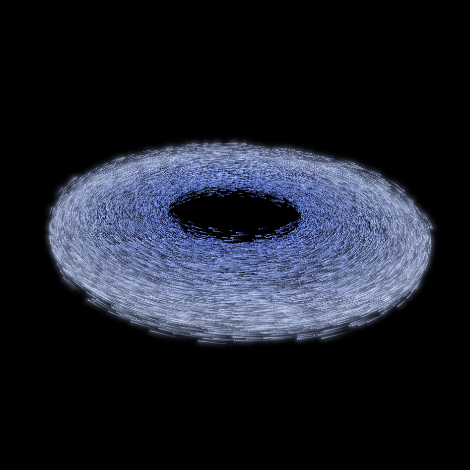
  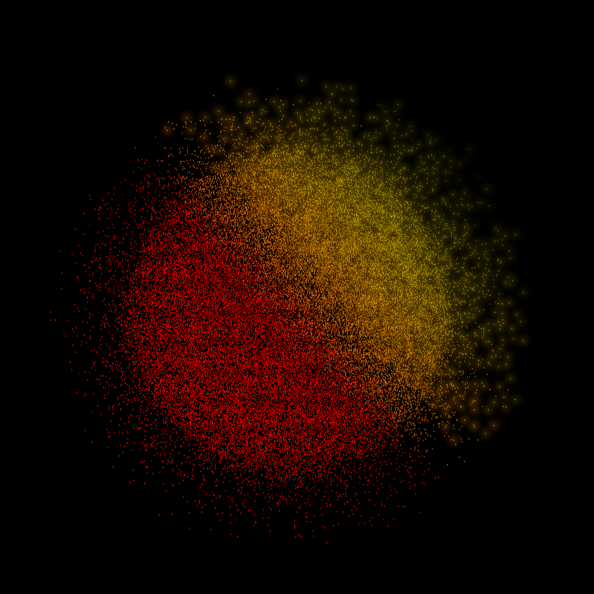
  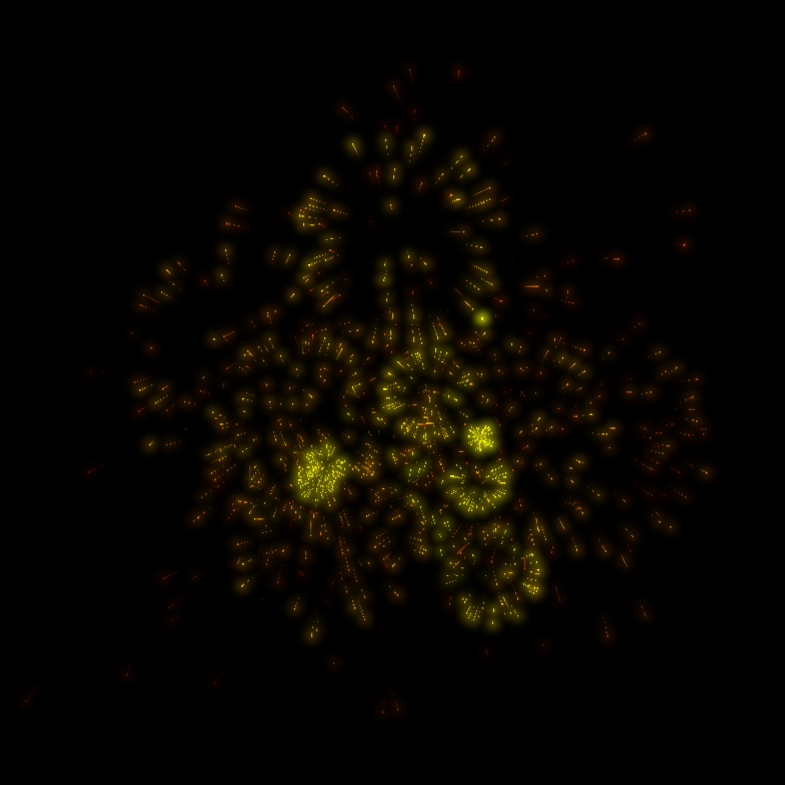
  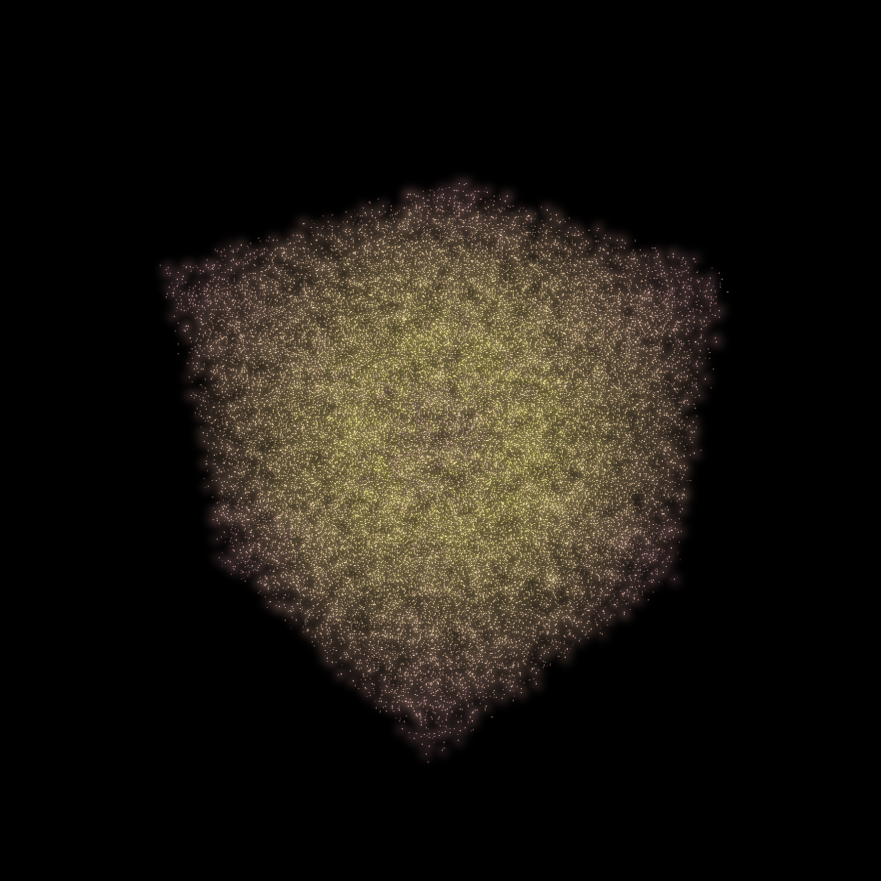

## Overview

GPU-driven particle system utilizing compute shaders for update and allocation pipelines. It offloads all physics updates, shape initializations, emitter logic, and memory pool management directly to graphics hardware. Particles are rendered using instanced camera-facing billboards, custom ribbon trails, and an HDR bloom post-processing pipeline.

## Built With

* **Core & Graphics**: C++, OpenGL 4.3, GLSL 4.30 (Compute Shaders, SSBOs, UBOs)
* **Libraries**: GLFW, GLAD, GLM, Dear ImGui

## Architecture and GPU Execution

* **Compute-Driven Processing**: Particle updating, spawning, and memory recycling occur entirely within compute shaders, bypassing CPU-side per-particle loops.
* **Atomic Free-List Management**: Active and inactive particle pools are maintained on the GPU using a lock-free free-list index array. Atomic additions and decrements handle instant memory acquisition and release across parallel GPU workgroups.
* **Buffer Storage**: Particle state, system configuration uniforms, sub-burst generation queues, and historical position histories are maintained inside Shader Storage Buffer Objects (SSBOs) and Uniform Buffer Objects (UBOs).

## Emission Systems

The simulation provides distinct particle generation methods suited for ambient effects, explosive events, and geometric volume generation:

  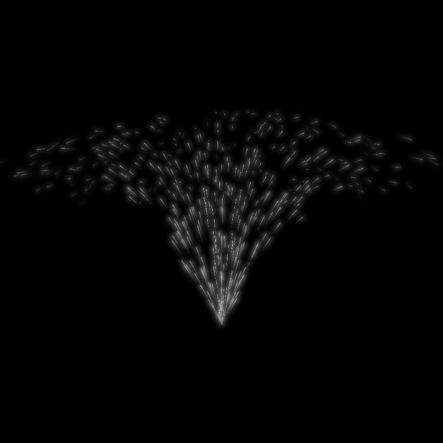
  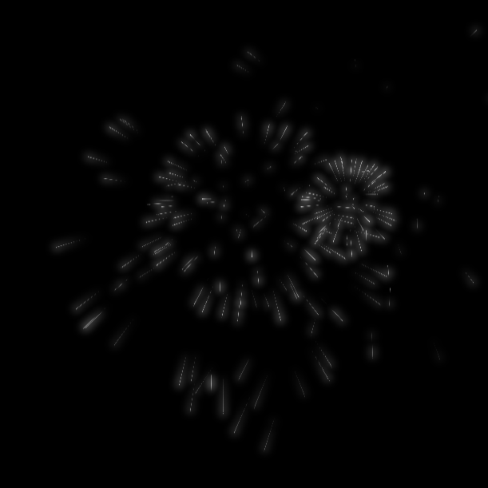
  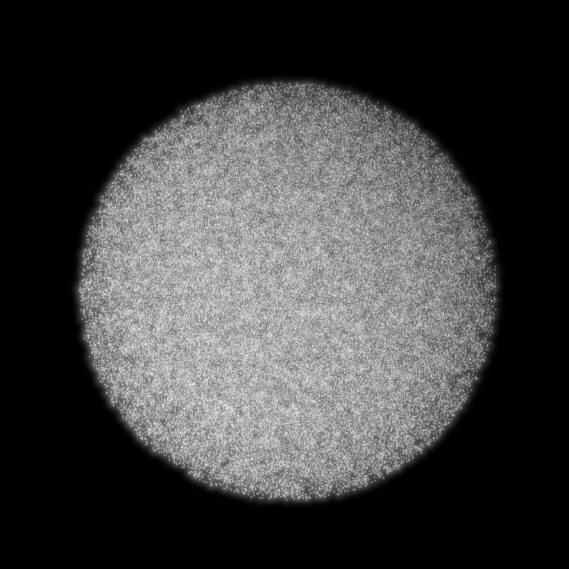
  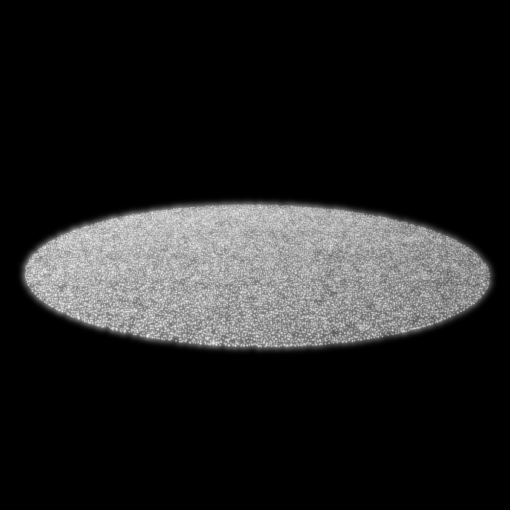
  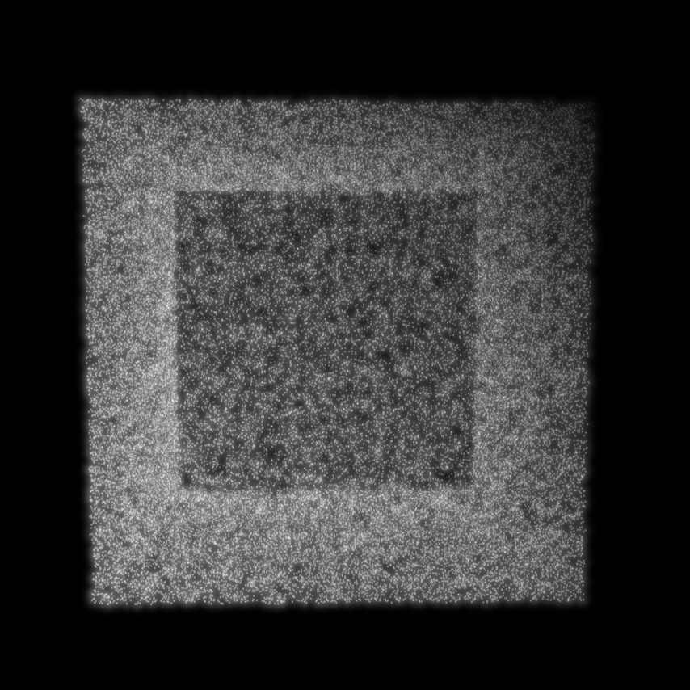

* **Continuous Emitters**: Emit particles continuously over time based on a designated spawn rate. Emission vectors follow a directional cone with configurable angular spread, velocity variation, and lifespan variation.
* **Burst Emitters**: Generate instant particle clusters. Secondary sub-bursts can be flagged to automatically trigger new particle explosions at the location where parent particles expire.
* **Shape Volume Initialization**: Generates particle configurations structured in Sphere, Disc, or Cube volumes. Shape initialization supports hollow interior cutouts, surface roughness displacement, offset ranges, and linear or radial gradient color distribution.

## Particle Dynamics and Physics

* **Life Cycle and Color Interpolation**: Non-immortal particles decay over their lifetime, shifting dynamically from a configured start color to an end color before releasing their memory slot upon death.
* **External Forces**: Configurable directional forces accelerate active particles across frame updates. For now, it's only Gravity.
* **Geometric Confinement**: Particles initialized within volumetric shapes can be constrained within their outer boundaries and hollow inner cores, bouncing off bounds with velocity damping.
* **Rotational Dynamics**: Volumetric particle shapes support orbital rotation around a central axis at controlled angular speeds.

## Rendering and Visual Effects

  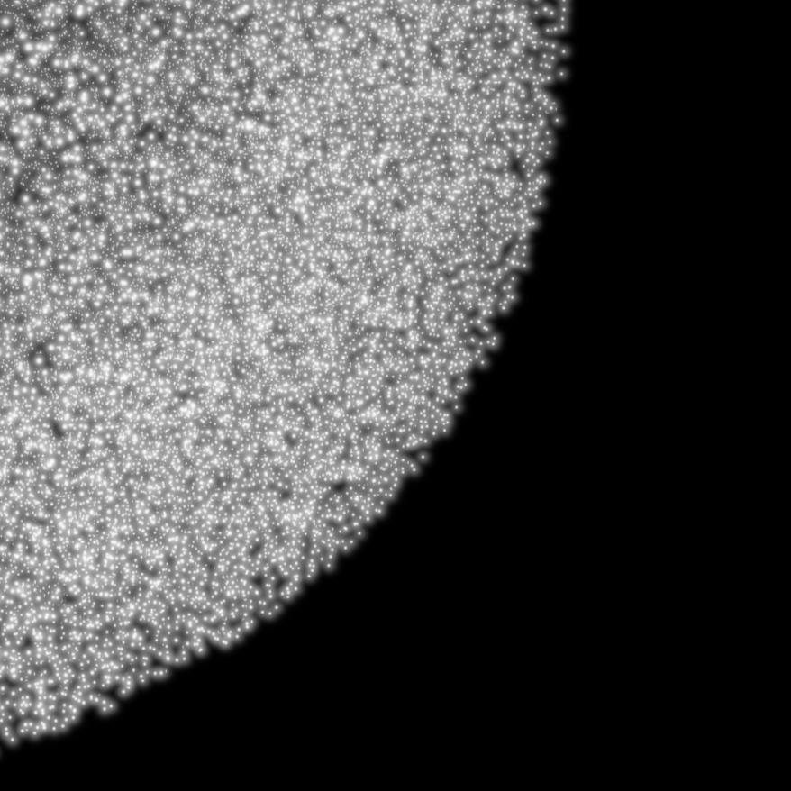
  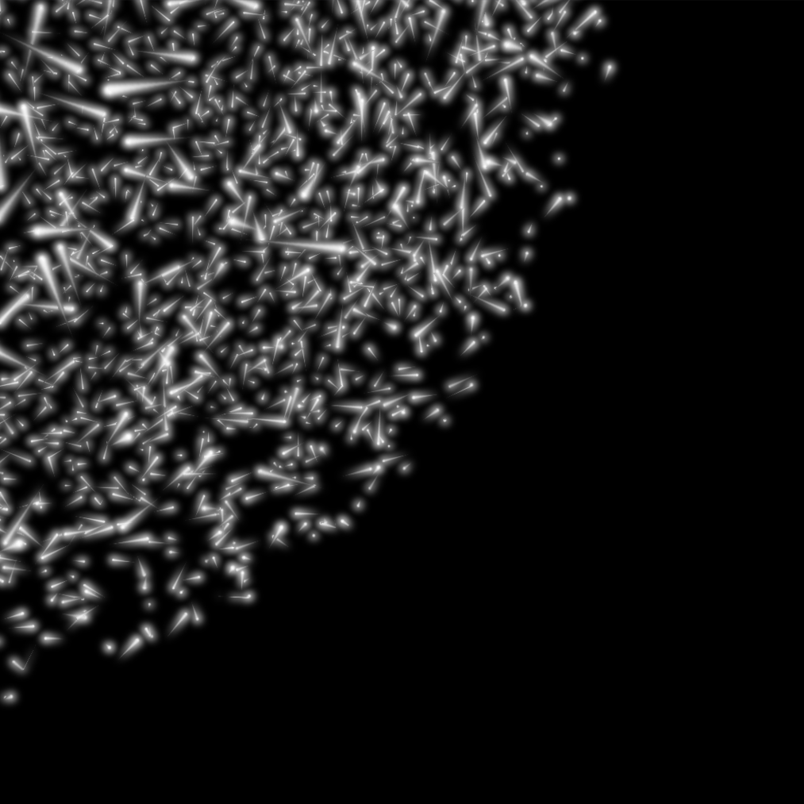

* **Instanced Camera-Facing Billboards**: Rendering is performed via instanced quad billboarding aligned to the current camera view matrix. Quad fragments feature radial glow falloff functions.
* **History-Based Ribbon Trails**: Particle positions are periodically recorded into fixed-size GPU ring buffers. Instanced ribbon meshes sample historical coordinates, constructing smooth trails oriented toward the camera via tangent and cross-product vectors, tapering in width and opacity over time.
* **HDR Bloom Pipeline**: High-dynamic-range rendering utilizes a multi-target framebuffer to isolate bright pixels into a secondary color attachment. A multi-pass Gaussian blur operates across ping-pong framebuffers before compositing the blurred glow over the primary color target using exposure tone-mapping and gamma correction.